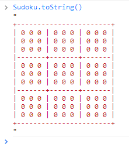
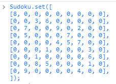
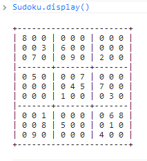
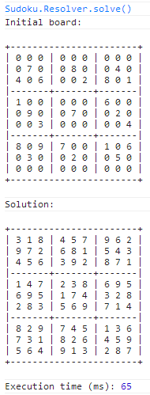

# Sudoku
Just having some fun with this game and its backtracking algorithm.

TO-DO:

1. Improvements in Sudoku.Resolver.
2. Implement Sudoku.Generator.
3. Implement Sudoku-cli for Nodejs command line.

## Sudoku API

**clear**

> Clears the board, setting all its cells to 0.

_Syntax:_
```javascript
Sudoku.clear(void): void
```
---

**toString**

> Returns the string representation of the board.



_Syntax:_
```javascript
Sudoku.toString(void): String
```
---

**get**

> Returns the board matrix.

_Syntax:_
```javascript
Sudoku.get(void): Number[][]
```
---

**set**

> Sets the board.



_Syntax:_
```javascript
Sudoku.set(_board: Number[][]): void
```
---

**display**

> Displays the string representation of the board in the console.



_Syntax:_
```javascript
Sudoku.display(void): void
```
---

**getValue**

> Gets the value from the cell [i, j].

_Syntax:_
```javascript
Sudoku.getValue(i: Number, j: Number): Number
```
---

**setValue**

> Sets a value of the cell [i, j].

_Syntax:_
```javascript
Sudoku.setValue(val: Number, i: Number, j: Number): void
```
---

**isCellEmpty**

> Indicates whether the cell is empty.

_Syntax:_
```javascript
Sudoku.isValueEmpty(i: Number, j: Number): Boolean
```
---

**emptyCell**

> Empties the cell [i, j].

_Syntax:_
```javascript
Sudoku.emptyValue(i: Number, j: Number): void
```
---

## Sudoku.Resolver API

**solve**

> Solves the sudoku using backtracking. This method will log in the console the initial board and the solution.



_Syntax:_
```javascript
Sudoku.Resolver.solve(_board?: Number[][]): void
```
---

## Sudoku.Generator API

TO-DO